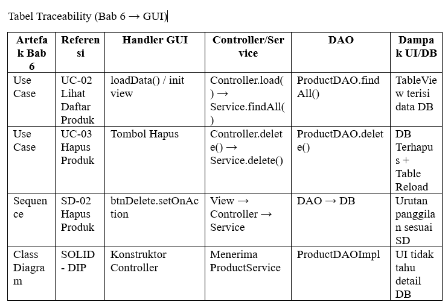

# Laporan Praktikum Minggu 13
Topik: GUI Lanjutan JavaFX (TableView dan Lambda Expression)

## Identitas
- Nama  : [SRI WAHYUNINGSIH]
- NIM   : [240202844]
- Kelas : [3IKRA]

---

## Tujuan
1. Mengimplementasikan TableView<Product> untuk menampilkan data terstruktur dari database.
2. Mengintegrasikan ObservableList dengan ProductDAO melalui ProductService.
3. Menerapkan Lambda Expression untuk menyederhanakan event handling pada tombol Hapus dan Tambah.
4. Menjamin traceability antara desain UML (Bab 6) dengan implementasi kode GUI.

---

## Dasar Teori
1. TableView: Komponen JavaFX yang digunakan untuk menampilkan data dalam bentuk baris dan kolom. Menggunakan CellValueFactory untuk menghubungkan properti objek dengan kolom.
2. Lambda Expression: Fitur Java 8+ yang memungkinkan penulisan fungsi anonim secara ringkas, sangat efektif untuk event handling seperti setOnAction(e -> { ... }).
3. ObservableList: Koleksi khusus JavaFX yang secara otomatis memberitahu UI jika ada perubahan data (tambah/hapus), sehingga TableView otomatis terbarui.

---

## Langkah Praktikum
1. Refactoring View: Mengubah ProductFormView agar menggunakan TableView<Product> sebagai pengganti ListView.
2. Setup Kolom: Mendefinisikan kolom Kode, Nama, Harga, dan Stok di dalam ProductTableView.
3. Update Controller: Menggunakan Lambda Expression pada btnDelete untuk mengambil item terpilih (getSelectionModel().getSelectedItem()).
4. Binding Data: Membuat metode loadData() yang mengambil List<Product> dari ProductService.findAll() dan memasukkannya ke dalam ObservableList.
5. Uji Coba CRUD: Menjalankan aplikasi untuk memastikan data yang dihapus di UI juga terhapus di database PostgreSQL.

---

## Kode Program
Kode Program Utama yang Digunakan
package com.upb.agripos.view;

import javafx.scene.control.Button;
import javafx.scene.control.TableColumn;
import javafx.scene.control.TableView;
import javafx.scene.control.cell.PropertyValueFactory;
import javafx.scene.layout.VBox;

import com.upb.agripos.model.Product;

public class ProductTableView extends VBox {

    public TableView<Product> table = new TableView<>();
    public Button btnAdd = new Button("Tambah Produk");
    public Button btnDelete = new Button("Hapus Produk");

    public ProductTableView() {

        TableColumn<Product, String> colCode = new TableColumn<>("Kode");
        colCode.setCellValueFactory(new PropertyValueFactory<>("code"));

        TableColumn<Product, String> colName = new TableColumn<>("Nama");
        colName.setCellValueFactory(new PropertyValueFactory<>("name"));

        TableColumn<Product, Double> colPrice = new TableColumn<>("Harga");
        colPrice.setCellValueFactory(new PropertyValueFactory<>("price"));

        TableColumn<Product, Integer> colStock = new TableColumn<>("Stok");
        colStock.setCellValueFactory(new PropertyValueFactory<>("stock"));

        table.getColumns().addAll(colCode, colName, colPrice, colStock);

        setSpacing(10);
        getChildren().addAll(table, btnAdd, btnDelete);
    }
}

---

## Hasil Eksekusi
1. Hasil Eksekusi awal

2. Hasil Eksekusi (jika hapus barang)

---

## Analisis
1. Efisiensi Kode: Penggunaan Lambda Expression memangkas kode boilerplate (seperti new EventHandler...) sehingga ProductController lebih mudah dibaca.
2. Interaktivitas: TableView memberikan pengalaman user yang lebih baik karena data terbagi per kolom dan mendukung pemilihan item (selection model) untuk proses penghapusan.
3. Konsistensi: Nama metode findAll dan delete tetap konsisten dengan yang didefinisikan pada Bab 6 dan praktikum JDBC sebelumnya.

---

## Kesimpulan
Praktikum Minggu 13 berhasil mengintegrasikan seluruh layer aplikasi Agri-POS. Dengan TableView, data produk tertata rapi. Penggunaan pola MVC dan SOLID memastikan aplikasi ini siap untuk tahap integrasi akhir (UAS).

---

