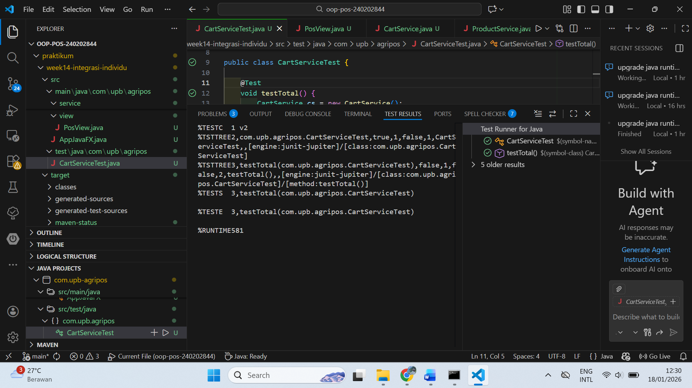

# Laporan Praktikum Minggu 14
Topik: Integrasi Individu (OOP + Database + GUI) – Agri-POS

## Identitas
- Nama  : [SRI WAHYUNINGSIH]
- NIM   : [240202844]
- Kelas : [3IKRA]

---

## Tujuan
1. Mengintegrasikan seluruh konsep OOP, SOLID, dan Design Pattern ke dalam aplikasi Agri-POS.
2. Menghubungkan antarmuka JavaFX dengan database PostgreSQL menggunakan layer DAO.
3. Mengimplementasikan fitur Keranjang Belanja menggunakan Java Collections.
4. Melakukan verifikasi logika bisnis menggunakan Unit Testing (JUnit).

---

## Dasar Teori
1. Model-View-Service-DAO Pattern: Pemisahan tanggung jawab kode agar aplikasi mudah dikelola (Separation of Powers).
2. Dependency Inversion Principle (DIP): High-level modules (View) tidak boleh bergantung langsung pada low-level modules (DAO), melainkan melalui abstraksi (Service).
3. Unit Testing: Pengujian otomatis pada unit terkecil kode (method/logic) untuk memastikan kebenaran fungsi tanpa menjalankan GUI.
4. JavaFX & JDBC: JavaFX untuk penyajian UI dan JDBC sebagai jembatan komunikasi antara aplikasi Java dengan database PostgreSQL.
---

## Langkah Praktikum
1. Setup Project: Mengatur struktur folder sesuai standar Maven/Gradle dengan pembagian package model, service, view, dan test.
2. Implementasi Logic: Membuat ProductService untuk logika stok dan CartService untuk perhitungan total belanja.
3. Integrasi GUI: Membangun AppJavaFX dan PosView yang menampilkan TableView dari data database.
4. Unit Testing: Membuat file CartServiceTest.java untuk menguji fungsionalitas keranjang.
5. Running & Console Log: Menjalankan aplikasi dan memastikan pesan identitas muncul di terminal.
6. Commit message (week14-integrasi-individu)

---

## Kode Program
Kode utama yang dibuat
1. KODE PROGRAM APPJAVAFX
package com.upb.agripos;

import com.upb.agripos.controller.PosController;
import com.upb.agripos.dao.JdbcProductDAO;
import com.upb.agripos.service.CartService;
import com.upb.agripos.service.ProductService;
import com.upb.agripos.view.PosView;
import javafx.application.Application;
import javafx.scene.Scene;
import javafx.stage.Stage;

public class AppJavaFX extends Application {

    @Override
    public void start(Stage stage) {

        System.out.println("Hello World, I am Sriwa-240202844");

        JdbcProductDAO productDAO = new JdbcProductDAO();

        ProductService productService = new ProductService(productDAO);
        CartService cartService = new CartService();

        PosController controller = new PosController(productService, cartService);

        PosView view = new PosView(controller);

        stage.setTitle("Agri-POS");
        stage.setScene(new Scene(view, 800, 500));
        stage.show();
    }

    public static void main(String[] args) {
        launch(args);
    }
}

2. KODE PROGRAM TEST
package com.upb.agripos;

import com.upb.agripos.model.Product;
import com.upb.agripos.service.CartService;
import org.junit.jupiter.api.Test;

import static org.junit.jupiter.api.Assertions.assertEquals;

public class CartServiceTest {

    @Test
    void testTotal() {
        CartService cs = new CartService();
        cs.add(new Product("P1", "Test", 1000, 10));
        assertEquals(1000, cs.total());
    }
}

---

## Hasil Eksekusi
1. Hasil eksekusi aap main

2. Hasil eksekusi junit

---

## Analisis
Analisis Kode: Aplikasi telah mengikuti struktur Layered Architecture. Berdasarkan screenshot explorer, terlihat pemisahan yang jelas antara model, service, dan view.
Perbedaan: Dibandingkan minggu sebelumnya, kali ini seluruh komponen (Database, UI, dan Logic) saling terhubung. Penggunaan CartService memisahkan logika perhitungan dari kelas UI (PosView).

1. Ringkasan Aplikasi
Aplikasi Agri-POS merupakan aplikasi Point of Sales sederhana berbasis JavaFX yang menerapkan konsep Object Oriented Programming (OOP) dan arsitektur MVC. Aplikasi ini mendukung fitur-fitur berikut:
•	Menampilkan daftar produk dalam bentuk tabel (TableView)
•	Menambahkan produk ke dalam keranjang belanja
•	Mengelola keranjang menggunakan struktur data Collection
•	Menghitung total harga belanja secara otomatis
•	Pengujian logika aplikasi menggunakan JUnit
Aplikasi ini dirancang tanpa ketergantungan langsung pada antarmuka grafis saat pengujian (unit test), sehingga mudah diuji dan dikembangkan.

2. Keterangan Integrasi Bab 1–13
Integrasi materi dari Bab 1 sampai Bab 13 pada aplikasi ini adalah sebagai berikut:
•	Bab 1 (Pengantar OOP): Penerapan konsep class, object, dan method
•	Bab 2 (Encapsulation): Penggunaan modifier private dan method getter/setter
•	Bab 3 (Inheritance): Struktur hierarki model dan service
•	Bab 4 (Polymorphism): Pemanfaatan interface DAO dan implementasinya
•	Bab 5 (Exception Handling): Penanganan error input dan proses logika
•	Bab 6 (UML): Use Case, Sequence, dan Activity Diagram sebagai acuan desain
•	Bab 7 (Collections): Penggunaan ArrayList pada keranjang belanja
•	Bab 8 (Generic & Type Safety): Penggunaan generic pada TableView JavaFX
•	Bab 9 (Layered Architecture): Pemisahan View, Controller, Service, dan DAO
•	Bab 10 (DAO Pattern): Akses data produk melalui ProductDAO
•	Bab 11 (Testing Dasar): Konsep pengujian unit
•	Bab 12 (JUnit): Implementasi unit test pada CartService
•	Bab 13 (Integrasi Sistem): Integrasi seluruh komponen menjadi aplikasi utuh

3. Artefak UML (Bab 6)
Artefak UML yang digunakan dan diperbarui dari Bab 6:
•	Use Case Diagram: Proses tambah produk dan tambah ke keranjang
•	Sequence Diagram: Alur interaksi antara View, Controller, Service, dan DAO
•	Activity Diagram: Alur aktivitas pengguna saat menambahkan produk ke keranjang
(Diagram berasal dari Bab 6 dan disesuaikan dengan implementasi saat ini)

4. KENDALA
1.	Kendala: Terjadi error method tidak ditemukan antara Controller dan Service
Solusi: Menyamakan kembali kontrak method pada Service dan memastikan Controller hanya memanggil method yang tersedia.
2.	Kendala: Konflik versi Java (Java 8 vs Java 17) pada Maven
Solusi: Menyesuaikan konfigurasi compiler Maven dan tetap memastikan aplikasi dapat dijalankan dengan JavaFX.
3.	Kendala: Unit test gagal karena logika bercampur dengan UI
Solusi: Memisahkan logika bisnis ke Service sehingga dapat diuji menggunakan JUnit tanpa JavaFX.

TABEL TRACEABILITY BAB 6

---

## Kesimpulan
Aplikasi Agri-POS berhasil mengintegrasikan konsep OOP, MVC, DAO, Collections, JavaFX, dan JUnit sesuai dengan ketentuan praktikum Week 14.

---
